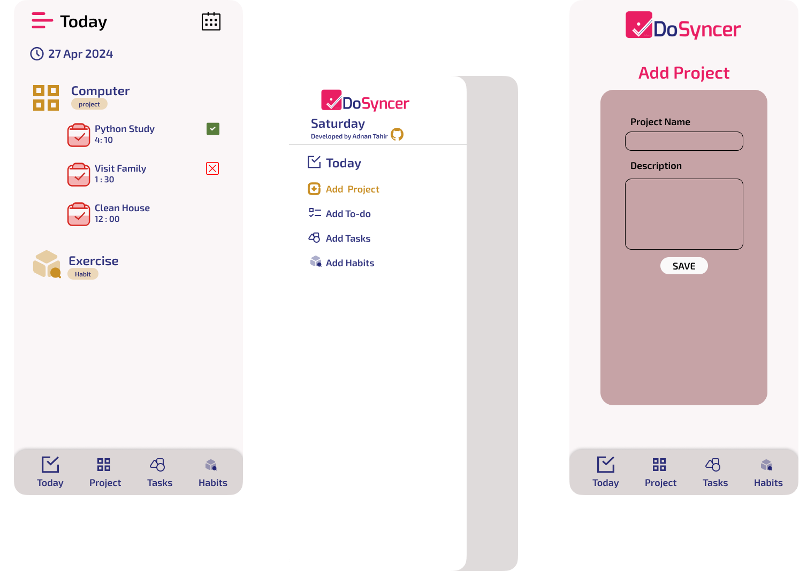

<p align="center">
    <a href="docs/img/DoSyncer_Logo.png">
        
    </a>
</p>

## Welcome To DoSyncer - Your Personal To-Do App 📝✨

DoSyncer is a productivity tool designed to streamline task management and habit tracking. With features ranging from intuitive to-do lists to seamless habit tracking, DoSyncer empowers users to efficiently manage their time and life. Sync your tasks effortlessly.

## Design

<p align="center">
    <a href="docs/img/Mobile_View.png">
        
    </a>
</p>


[](LICENSE)

## Features

- **Task Management**: Create, edit, and organize your tasks with an easy-to-use interface.
- **Habit Tracking**: Track your daily habits and monitor your progress over time.
- **Organize Todos**: Organize Todo based on their category. 


### Clone the Repository

```bash
git clone https://github.com/adnantabda/DoSyncer.git
cd DoSyncer
```

### Install Dependencies

```bash
npm install
```

### Running the Application


```bash
npx webpack --watch
```

## Usage

1. **Create Tasks:** Add new tasks by entering a title and optional description.
2. **Organize Tasks:** Use categories or tags to organize your tasks.
3. **Track Habits:** Set up daily or weekly habits you want to build and start tracking your progress.
4. **View Analytics:** Monitor your productivity and habit consistency with built-in analytics.

## Contributing

Contributions are welcome! If you'd like to contribute to DoSyncer, please follow these steps:

1. Fork the repository.
2. Create a new branch (`git checkout -b feature-branch`).
3. Commit your changes (`git commit -m 'Add some feature'`).
4. Push to the branch (`git push origin feature-branch`).
5. Open a pull request.

## License

This project is licensed under the MIT License - see the [LICENSE](LICENSE) file for details.
